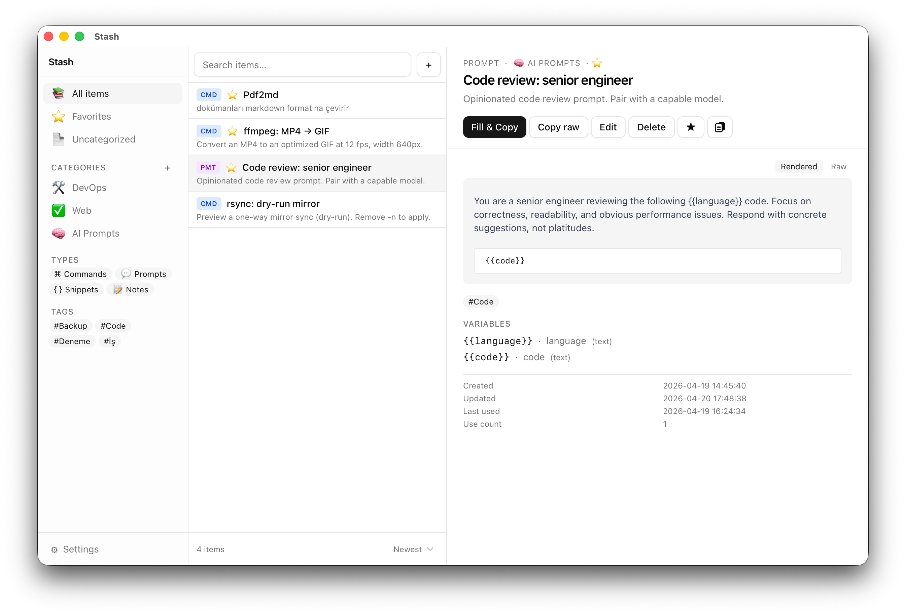
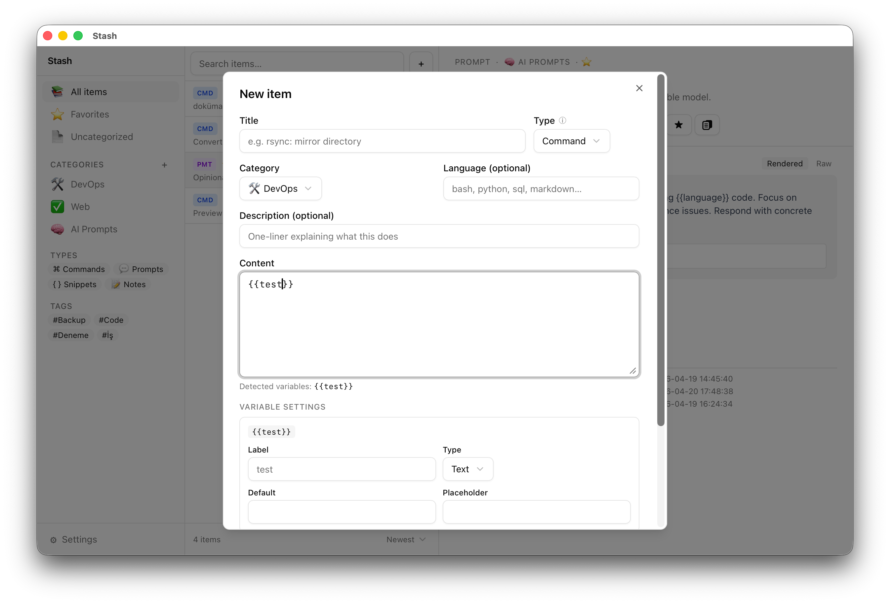
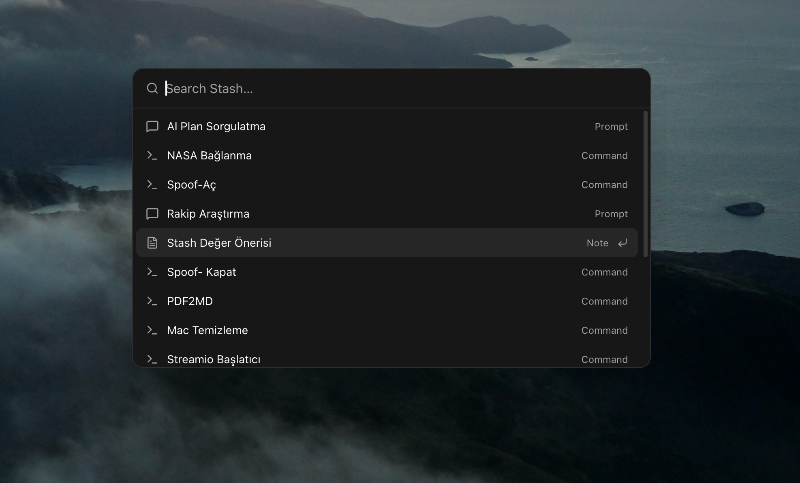
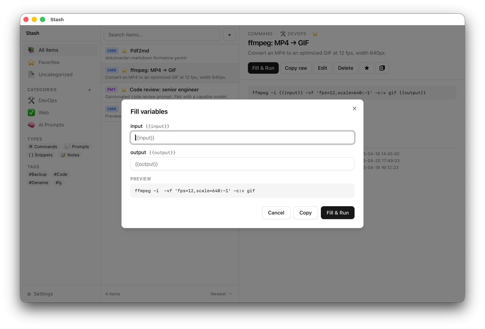

# Stash

> Native macOS hub for commands, prompts, and snippets you keep forgetting.

Stash stores, organizes, and runs the terminal commands, AI prompts, and code snippets you use repeatedly but can't keep in your head. Local-first, keyboard-driven, SQLite-backed.



## Why Stash

- **Remembers for you** — FFmpeg flags, rsync incantations, curl one-liners, SSH tunnels, LlamaParse/Dockling scripts, all one search away.
- **Prompt library** — keep your Claude / ChatGPT prompts with `{{variables}}`, fill them in a form, copy ready-to-paste output.
- **Snippet grab-bag** — HTML boilerplate, SQL queries, regex patterns, config blobs — tagged and searchable.
- **Runs commands too** — commands open in Terminal.app with a confirmation dialog and danger detection (`rm -rf`, `sudo`, `curl | sh`, and friends).

## Screenshots

<p align="center">
  
  
</p>

<p align="center">
  
</p>

## Features

- Full-text search (SQLite FTS5) across titles, content, descriptions
- Four item types — commands, prompts, snippets, notes — in one unified list
- Categories with item-count badges, tags, and type filters in a collapsible sidebar
- Drag an item from the list onto a category to file it
- Parameterized items with `{{variable}}` placeholders and a fill-in form
- Command execution in Terminal.app with danger detection and a confirmation dialog — or, opt-in per item, silently in the background with the result shown inline
- **Global quick-launch** — a configurable system-wide hotkey (default `⌘⇧Space`) opens a search bar from anywhere
- Command palette (`⌘K`) inside the app
- Menu bar tray with quick access to favorite and recent items
- Markdown rendering for prompts and notes (GFM: tables, task lists, code blocks)
- Automatic local backups, plus manual JSON export / import
- Starter packs (Git, Docker, FFmpeg, macOS, SSH, AI Prompts, SQL Snippets) on first launch
- Light / Dark / System theme
- Keyboard-first: arrows to navigate, `⌘F` to search, `⌘N` for new item, `Enter` to run the primary action
- Sort items by Recently used / Most used / Newest / A → Z

## Install

Stash is currently macOS-only (Apple Silicon) and ships unsigned.

### Download

Grab the latest `.dmg` from the [Releases page](https://github.com/codeeren/stash/releases) and drag Stash into `/Applications`.

The build is unsigned (no Apple Developer ID yet), so on first launch macOS Sequoia blocks the app. To get past the block, open Terminal and run:

```bash
xattr -dr com.apple.quarantine /Applications/Stash.app
```

Then open Stash normally. You only need to do this once.

### Build from source

**Prerequisites:** macOS 13+, Node.js 18+, Rust (via [rustup](https://rustup.rs)).

```bash
git clone https://github.com/codeeren/stash.git
cd stash
npm install
npm run build:release
```

The bundle lands in `src-tauri/target/release/bundle/macos/Stash.app`. Drag it into `/Applications`. (`build:release` runs `tauri build` and a post-bundle step that strips a stale Carbon flag from the Info.plist so macOS doesn't mistakenly flag the app as Intel-only.)

### Run in development

```bash
npm install
npm run tauri dev
```

## Usage

- **`⌘⇧Space`** — global quick-launch (works from any app; configurable, can be turned off)
- **`⌘K`** — command palette
- **`⌘F`** — focus search
- **`⌘N`** — new item
- **`⌘,`** — open settings
- **Arrow keys** — move through the item list
- **Enter** — run the selected item's primary action (Fill & Copy / Run / Copy)
- **Esc** — clear search

Commands are the only type that *executes*. Prompts, snippets, and notes are copied to your clipboard. Use categories and tags to group items; use types to pick behavior.

On a fresh install, Stash offers optional starter packs so you have something to explore right away.

Your data lives in the app's folder under `~/Library/Application Support/`, with automatic JSON backups in its `backups/` subfolder.

## Safety

Command execution always shows a confirmation dialog with the resolved command. Dangerous patterns (`rm -rf`, `sudo`, `curl … | sh`, `dd`, `mkfs`, `> /dev/...`) trigger a red warning before you can run. Every execution is logged. Stash never fetches or runs remote code — variables are resolved locally.

## Tech stack

- [Tauri 2](https://tauri.app) (Rust) — smaller bundle and lower memory than Electron
- [React 19](https://react.dev) + TypeScript + Vite
- [Tailwind CSS](https://tailwindcss.com) + [shadcn/ui](https://ui.shadcn.com)
- [Zustand](https://zustand-demo.pmnd.rs) for state
- SQLite (via `tauri-plugin-sql`) with FTS5 for search
- `tauri-plugin-global-shortcut` for the quick-launch hotkey

## Roadmap

- **v0.2** — AI integration (direct Claude / OpenAI calls for prompt items)
- **v0.3** — iCloud / Syncthing sync
- **v0.4** — Plugin system, imports from Raycast / Alfred, CLI companion

## Contributing

Pull requests welcome. Keep changes small and follow [Conventional Commits](https://www.conventionalcommits.org). TypeScript is strict; Rust must be `clippy`-clean.

## License

MIT — see [LICENSE](LICENSE).
